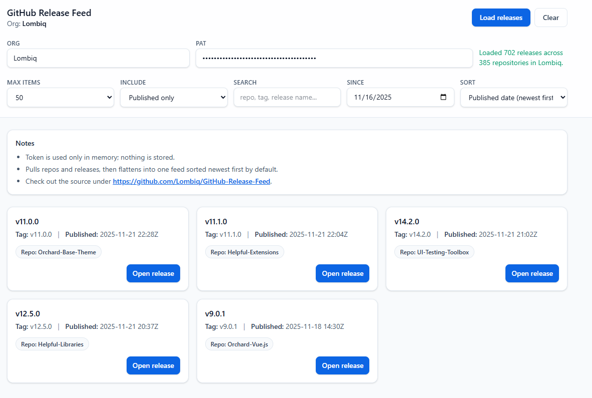

# Lombiq GitHub Release Feed

## About

Single-page release feed that fetches the latest releases across all repositories of a GitHub organization via the GitHub GraphQL API. Enter an org login and a PAT, apply filters (include drafts/prereleases, max items, search, since, sort), and open releases with one click. The UI is a single `index.html` using Tailwind (Play CDN), with no persistence (token kept in memory only). Most of the code was generated with AI assistance; see `AGENTS.md` for notes agents use to keep context across sessions.

## Documentation

- Run locally: open `index.html` in a browser, enter the organization name and a PAT with access to the org’s public and private repos.
- The app is deployed to a DotNest site at https://githubreleasefeed.dotnest.net/ so you can see it live. DotNest is a managed Orchard Core CMS-as-a-Service, maintained by [Lombiq](https://lombiq.com), that lets you run production-ready [Orchard Core](https://orhardproject.net) sites without having to handle hosting, upgrades, or infrastructure. This project is deployed on [DotNest](https://dotnest.com), so you can see it running live in a real Orchard environment.
- If you want to run it deployed, be sure to add the `connect-src https://api.github.com` as a `Content-Security-Policy` directive to allow the app to access the GitHub API.

## Contributing and support

Bug reports, feature requests, comments, questions, code contributions and love letters are warmly welcome. You can send them to us via GitHub issues and pull requests. Please adhere to our [open-source guidelines](https://lombiq.com/open-source-guidelines) while doing so.

This project is developed by [Lombiq Technologies](https://lombiq.com/). Commercial-grade support is available through Lombiq.
